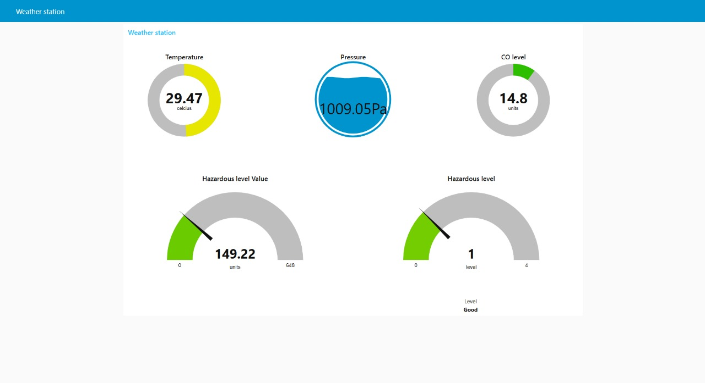
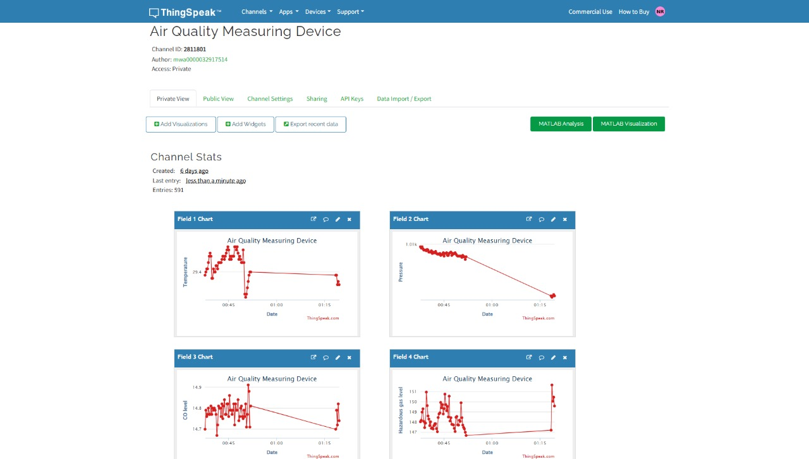
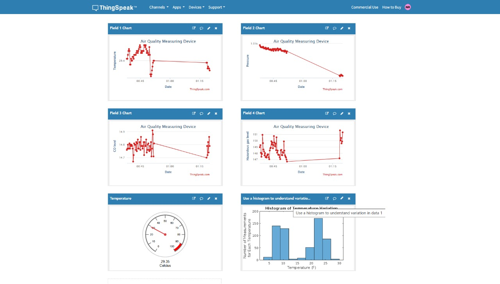

# Weather Station Project

This repository contains the Weather Station Project, which integrates sensors, Node-RED, ThingSpeak, and Python scripts for real-time environmental data monitoring and visualization.

## Table of Contents

1. [Introduction](#introduction)
2. [Features](#features)
3. [Setup Instructions](#setup-instructions)
   - [Dependencies](#dependencies)
   - [Installation](#installation)
4. [Usage](#usage)
5. [Troubleshooting](#troubleshooting)
6. [Documentation](#documentation)

## Introduction

The Weather Station Project collects data such as temperature, pressure, and hazardous gas levels using sensors connected to a Raspberry Pi. The data is processed using Python scripts, visualized with Node-RED dashboards, and uploaded to ThingSpeak for remote monitoring.

### Node-RED Dashboard Example


## Features

- Real-time monitoring of environmental parameters.
- Integration with ThingSpeak for cloud-based visualization.
- Local dashboards using Node-RED.
- Mobile notifications for threshold alerts.

### Node-RED Flow Overview


## Setup Instructions

### Dependencies

Ensure you have the following:

- Raspberry Pi with Raspbian OS.
- Sensors: BMP280, MQ7, MQ135.
- Python 3.7 or above.
- Node-RED installed.

### Installation

1. Clone the repository:
   ```bash
   git clone https://github.com/RavishanBBN/Weather-Station.git
   cd Weather-Station
   ```
2. Install Python dependencies:
   ```bash
   sudo apt update
   sudo apt install python3-pip
   pip3 install -r requirements.txt
   ```
3. Set up Node-RED:
   ```bash
   sudo npm install -g --unsafe-perm node-red
   node-red
   ```
4. Configure ThingSpeak:
   - Create a ThingSpeak channel.
   - Note the API key for data uploads.

### ThingSpeak Dashboard Example


## Usage

1. Run the Python script to collect and send data:
   ```bash
   python3 weather_station.py
   ```
2. Open Node-RED to view local dashboards.
3. Check ThingSpeak for real-time cloud visualizations.

### ThingSpeak Dashboard Output


## Troubleshooting

- **Sensor Read Errors**: Check wiring and sensor connections.
- **Missing Libraries**: Ensure all dependencies in `requirements.txt` are installed.
- **Node-RED Issues**: Restart Node-RED and check logs for errors.
- **ThingSpeak Upload Errors**: Verify the API key and channel configurations.

## Documentation

For detailed setup instructions, error handling, and system diagrams, refer to the [Documentation](./Documentation) folder.

---

### Sensor Connections


### Node-RED Code


### ThingSpeak Code


### ThingSpeak Dashboard 2

